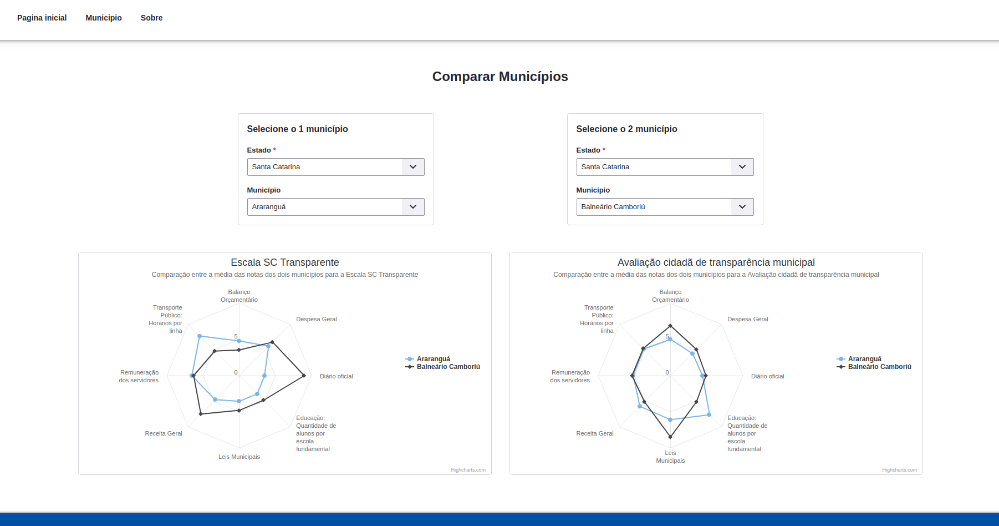

<h1 align="center">
    Avaliação Municipal
</h1>

<p align="center">
  <a href="#-tecnologias">Tecnologias</a>&nbsp;&nbsp;&nbsp;|&nbsp;&nbsp;&nbsp;
  <a href="#-projeto">Projeto</a>&nbsp;&nbsp;&nbsp;|&nbsp;&nbsp;&nbsp;
  <a href="#-como-executar">Como executar</a>&nbsp;&nbsp;&nbsp;|&nbsp;&nbsp;&nbsp;
  <a href="#-licença">Licença</a>
</p>

<p align="center"> 
  
</p>

## 🚀 Aplicação

<p align="center"> 
  
</p>

## 🛠 Tecnologias

As seguintes ferramentas foram usadas na construção do projeto:

  Front-end:

- [Bold](https://bold.bridge.ufsc.br/pt/)
- [React](https://pt-br.reactjs.org/)
- [TypeScript](https://www.typescriptlang.org/)
- [Highcharts](https://www.highcharts.com/)


 Back-end:
  
 - [Java](https://www.java.com/pt-BR/)
 - [Spring](https://spring.io/)
 - [Lombock](https://projectlombok.org/)

## 💻 Projeto

Desenvolvimento de uma plataforma web para que seja possível avaliar o nível de transparência em sites municipais brasileiros baseando-se em um conjunto de fatores. Podendo-se comparar municípios e gerar relatórios de auxilio.

## ✨ Como executar

```bash
# Clone o repositório
$ git clone https://github.com/wellingtondsf/avaliacao-municipal

# Entre na pasta do repositório
$ cd avaliacao-municipal

# Inicie o container docker
$ docker start avaliacao-municipal

# Inicie o servidor
# Execute a seguinte classe AvaliacaoMunicipalApplication.java localizada no backend

# Na pasta raiz da aplicacao entre em frontend
# Instale as dependências
$ yarn install

# Inicie o servidor da aplicação
# servidor iniciara na porta 3000
$ yarn dev
```

## 📜 Licença

Esse projeto está sob a licença MIT. Veja o arquivo [LICENSE](LICENSE) para mais detalhes.
